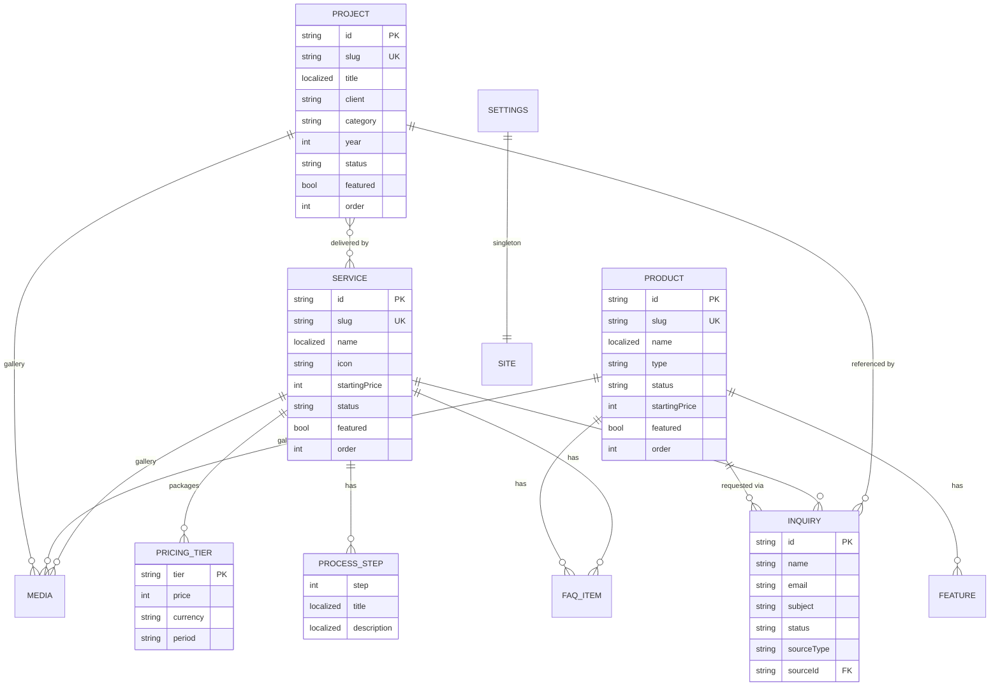

# DATABASE_SCHEMA.MD — The Data Map

> Store: **Vercel KV (Upstash Redis)**. There is no SQL, no join, and no query planner —
> every access path below must have an index key that writes keep in sync.
> Phase 1 mirrors these exact shapes in memory.

---

## 1. Entity Relationship



---

## 2. Shared Types

```ts
/** Translatable text. `en` required, `id` optional — falls back to `en`. */
export type Localized = { en: string; id: string };

export type Locale = 'en' | 'id';
export type PublishStatus = 'draft' | 'published';

/** Fixed three-step ladder. Display order is derived from this rank, never sorted manually. */
export const TIER_RANK = { basic: 0, gold: 1, premium: 2 } as const;
export type Tier = keyof typeof TIER_RANK;

/**
 * One priced package. **Service only** — Product has no tiers (see PriceInfo below).
 *
 * `tier` IS the identity — no separate id, no stored name. The visible labels
 * ("Basic" / "Gold" / "Premium") and the CTA label live in the i18n dictionary,
 * so naming stays identical across every service and is never retyped.
 *
 * Gold is always the emphasized card — there is no `highlighted` flag to get wrong.
 * `price: null` renders as "Contact us". No payment identifier ever lives here —
 * every CTA opens an inquiry. See ARCHITECTURE.md ADR-010.
 */
export interface PricingTier {
  tier: Tier;
  price: number | null;
  currency: 'IDR' | 'USD';
  period: 'one-time' | 'monthly' | 'yearly' | 'project';
  description: Localized;
  includes: Localized[];
}

/**
 * A single indicative price. **Product only** — products are not sold in tiers.
 * `startingPrice: null` renders as "Contact us".
 */
export interface PriceInfo {
  startingPrice: number | null;
  currency: 'IDR' | 'USD';
  unit: 'project' | 'month' | 'year' | 'license' | 'day';
  note: Localized;               // "starting from", "depends on scope"
}

export interface FaqItem {
  id: string;
  question: Localized;
  answer: Localized;
}

export interface MediaRef {
  url: string;
  alt: Localized;
  width: number;
  height: number;
  caption?: Localized;
}

export interface Timestamps {
  createdAt: string;   // ISO 8601 UTC
  updatedAt: string;
  publishedAt: string | null;
}
```

---

## 3. Project (portfolio / client work)

```ts
export type ProjectCategory =
  | 'web-app' | 'mobile-app' | '3d-animation' | 'packaging' | 'branding';

export interface Project extends Timestamps {
  id: string;                    // proj_<nanoid12>
  slug: string;                  // unique, kebab-case, immutable after publish
  title: Localized;
  client: string;
  category: ProjectCategory;
  year: number;
  summary: Localized;            // ≤ 200 chars, used on cards and OG
  cover: MediaRef;
  gallery: MediaRef[];

  // Case study body
  challenge: Localized;          // markdown
  solution: Localized;           // markdown
  outcome: Localized;            // markdown
  results: Array<{ label: Localized; value: string }>;   // e.g. "Load time" / "-63%"

  serviceIds: string[];          // → Service.id. Powers "projects delivered under this service"
  stack: string[];               // "Next.js", "Three.js", …
  role: Localized;
  durationMonths: number | null;
  liveUrl: string | null;

  status: PublishStatus;
  featured: boolean;
  order: number;                 // manual sort, lower = first
  seo: { title: Localized; description: Localized; ogImage: string | null };
}
```

**Invariants**
- `slug` unique across projects; changing it after publish must write a redirect entry.
- `title.en`, `summary.en`, `cover` required to move to `published`.
- `order` unique within the collection; reorder rewrites the whole index.
- `serviceIds` must reference existing services. Deleting a service strips its id from every project (see §7 write protocol); dangling ids are filtered on read as a second line of defence.

---

## 4. Product (apps QORV sells)

```ts
export type ProductType = 'web-app' | 'mobile-app' | 'desktop-app' | 'tool' | 'template';
export type ProductStatus = 'available' | 'beta' | 'coming-soon';

export interface ProductFeature {
  id: string;
  icon: string;                  // lucide icon name — validated against an allowlist
  title: Localized;
  description: Localized;
}

// PricingTier and FaqItem are the shared types from §2 — not redefined here.

export interface ChangelogEntry {
  version: string;               // semver
  date: string;                  // ISO
  notes: Localized;              // markdown
}

export interface Product extends Timestamps {
  id: string;                    // prod_<nanoid12>
  slug: string;
  name: Localized;
  tagline: Localized;            // ≤ 100 chars
  type: ProductType;
  productStatus: ProductStatus;

  cover: MediaRef;
  gallery: MediaRef[];           // screenshots / walkthrough
  demoVideoUrl: string | null;

  description: Localized;        // markdown, long form
  features: ProductFeature[];

  // Spec sheet
  platforms: string[];           // "Web", "iOS", "Android", "Windows"
  techStack: string[];
  integrations: string[];
  requirements: Localized[];

  price: PriceInfo;              // single indicative price — products have NO tiers
  faqs: FaqItem[];
  changelog: ChangelogEntry[];
  currentVersion: string | null;

  demoUrl: string | null;
  docsUrl: string | null;
  relatedProductIds: string[];

  status: PublishStatus;
  featured: boolean;
  order: number;
  seo: { title: Localized; description: Localized; ogImage: string | null };
}
```

**Invariants**
- **No tiers.** `price` is one `PriceInfo`; `price.startingPrice: null` renders "Contact us". A product that needs plans is a new decision, not a quiet array.
- `relatedProductIds` must not include the product's own id; dangling ids are filtered on read.
- No field anywhere may carry a payment URL, price id, or checkout token.

---

## 4a. Service (what QORV does for hire)

```ts
export interface ProcessStep {
  id: string;
  step: number;                  // 1-based, contiguous
  title: Localized;
  description: Localized;
  durationLabel: Localized;      // "1–2 weeks" — free text, not a computed value
}

export interface Service extends Timestamps {
  id: string;                    // svc_<nanoid12>
  slug: string;
  name: Localized;
  tagline: Localized;            // ≤ 100 chars
  icon: string;                  // lucide icon name, validated against an allowlist

  cover: MediaRef;
  gallery: MediaRef[];

  description: Localized;        // markdown, long form
  deliverables: Localized[];     // what the client actually receives
  process: ProcessStep[];
  tools: string[];               // "Figma", "Blender", "Next.js"

  packages: PricingTier[];       // Service-only. 0–3 entries, one per tier, unique
  startingPrice: number | null;  // DERIVED from the cheapest package — never hand-entered
  currency: 'IDR' | 'USD';
  timelineLabel: Localized;      // "4–8 weeks" — typical engagement length

  faqs: FaqItem[];
  relatedServiceIds: string[];

  status: PublishStatus;
  featured: boolean;
  order: number;
  seo: { title: Localized; description: Localized; ogImage: string | null };
}
```

**Invariants**
- `packages` may be empty → the page shows a single "Request a quote" CTA instead of a package grid.
- **Tiers are unique.** At most one `basic`, one `gold`, one `premium`. A service may offer any subset (e.g. Basic + Gold only) — all three are not required.
- Packages always render in ladder order (`basic → gold → premium`) via `TIER_RANK`, regardless of array order. Gold is always the emphasized card.
- Package labels are **not stored** — they come from the dictionary. Renaming the ladder is a one-line dictionary change, not a data migration.
- `startingPrice` is **derived, never hand-entered**: recomputed on every write as the lowest non-null `packages[].price`, or `null` if all are null. Hand-editing it is how a card and its detail page start disagreeing.
- `process[].step` must be contiguous from 1 — reordering renumbers.
- `relatedServiceIds` excludes the service's own id.
- Related projects are **not stored here.** They are resolved by querying projects whose `serviceIds` contain this id — one direction of truth only.

---

## 5. Inquiry

```ts
export type InquiryStatus = 'new' | 'read' | 'replied' | 'archived';
export type InquirySource = 'contact' | 'project' | 'product' | 'service' | 'pricing';

export interface Inquiry {
  id: string;                    // inq_<nanoid12>
  name: string;
  email: string;
  company: string | null;
  phone: string | null;
  subject: string;
  message: string;
  budgetRange: string | null;

  sourceType: InquirySource;
  sourceId: string | null;       // project, product, or service id
  sourceTier: Tier | null;       // 'basic' | 'gold' | 'premium' — the budget signal.
                                 // Always null for product and contact inquiries.
  locale: Locale;                // locale the visitor was browsing in

  status: InquiryStatus;
  createdAt: string;
  readAt: string | null;
  repliedAt: string | null;
  meta: { ip: string | null; userAgent: string | null; referrer: string | null };
}
```

Not localized — this is user-submitted data, stored verbatim.

---

## 6. Settings (singleton)

```ts
export interface Settings {
  studioName: string;
  tagline: Localized;
  email: string;
  whatsapp: string;
  address: Localized | null;
  socials: Array<{ platform: string; url: string }>;
  seoDefaults: { title: Localized; description: Localized; ogImage: string | null };
  updatedAt: string;
}
```

---

## 7. KV Key Map

| Key | Type | Contents |
|-----|------|----------|
| `project:{id}` | JSON | Full `Project` |
| `project:slug:{slug}` | string | → `id` |
| `projects:index` | ZSET | member `id`, score `order` — canonical list order |
| `projects:published` | ZSET | published only, score `order` |
| `projects:cat:{category}` | ZSET | published, per category |
| `projects:featured` | ZSET | published + featured |
| `projects:search` | JSON | `[{ id, slug, title, client, summary, category, year }]` — lightweight scan cache |
| `product:{id}` | JSON | Full `Product` |
| `product:slug:{slug}` | string | → `id` |
| `products:index` | ZSET | member `id`, score `order` |
| `products:published` | ZSET | published only |
| `products:status:{status}` | ZSET | available \| beta \| coming-soon |
| `products:featured` | ZSET | published + featured |
| `products:search` | JSON | scan cache, same shape idea |
| `service:{id}` | JSON | Full `Service` |
| `service:slug:{slug}` | string | → `id` |
| `services:index` | ZSET | member `id`, score `order` |
| `services:published` | ZSET | published only |
| `services:featured` | ZSET | published + featured |
| `services:search` | JSON | `[{ id, slug, name, tagline, startingPrice }]` scan cache |
| `service:{id}:projects` | ZSET | project ids delivered under this service — reverse index of `Project.serviceIds` |
| `inquiry:{id}` | JSON | Full `Inquiry` |
| `inquiries:index` | ZSET | score = `createdAt` epoch, newest first |
| `inquiries:status:{status}` | ZSET | per-status filter |
| `settings` | JSON | Singleton |
| `redirect:{oldSlug}` | string | → new slug, for changed slugs |
| `ratelimit:inquiry:{ip}` | string + TTL | Sliding counter, 60s TTL |
| `ratelimit:login:{ip}` | string + TTL | 5 attempts / 15 min |
| `media:index` | ZSET | Uploaded blob URLs, score = upload time |

### Write protocol (mandatory — partial writes corrupt the indexes)

Every create/update/delete runs as **one pipeline**:
1. Write/delete `project:{id}`
2. Write/delete `project:slug:{slug}` (and `redirect:{oldSlug}` if the slug changed)
3. Add/remove the id in `projects:index`
4. Recompute membership in `projects:published`, `projects:cat:*`, `projects:featured` — remove from stale sets before adding to the new one
5. Rebuild `projects:search`
6. Revalidate the `projects` cache tag

If step 4 is skipped, an unpublished project keeps appearing in category listings. This is the single most common bug class in this design — the repository must own it so no caller can get it wrong.

### Cross-entity writes (Service ↔ Project)

Two relationships have no foreign-key enforcement and must be maintained by hand:

**On project create/update** — if `serviceIds` changed:
1. Remove the project id from `service:{oldId}:projects` for every removed service
2. Add it to `service:{newId}:projects` for every added service

**On project delete** — remove the project id from `service:{id}:projects` for every id in its `serviceIds`.

**On service delete** — for every project id in `service:{id}:projects`, load the project, strip this service id from `serviceIds`, and write it back. Then delete the reverse-index key. Skipping this leaves projects pointing at a service that no longer exists.

**On service create/update** — recompute `startingPrice` from `packages` (lowest non-null `price`, else `null`) before writing. Never persist a client-supplied `startingPrice`. Products have no such derivation: `price.startingPrice` is entered directly.

Reads filter dangling ids defensively as well, so a missed cleanup degrades a listing rather than crashing a page.

### Known ceilings (accepted)
- **Search is a substring scan** over the cached index array. Fine to ~500 items; past that, move to a search index or Postgres. The `Repository<T>` seam is the escape hatch.
- **No cross-entity transactions.** Deleting a product or service does not cascade to inquiries — inquiries keep `sourceId` and render "deleted". The Service↔Project cleanup above *is* performed, but not atomically: a mid-pipeline failure can leave one dangling id, which reads filter out.
- **`/pricing` loads all published services and products** to compose the page. Fine at this scale; if either collection passes a few hundred, add a dedicated pricing projection key.
- **Services and products present pricing differently on purpose** — services show a package grid, products show one indicative price. Two shapes, deliberately, because the offerings are not comparable.
- **Sorting is limited to indexed scores.** Sorting by an arbitrary field means loading the index cache and sorting in memory.

---

## 8. ID & Slug Rules

- IDs: `{prefix}_{nanoid(12)}` — `proj_`, `prod_`, `svc_`, `inq_`, `med_`. Non-sequential, so ids in URLs are not enumerable.
- Slugs: lowercase, `a-z0-9-`, generated from `title.en`, uniqueness enforced against the slug pointer key, editable while `draft`, and redirect-preserved once published.
- All timestamps are ISO 8601 UTC strings. Display formatting happens at render time via `Intl.DateTimeFormat(locale)`.
